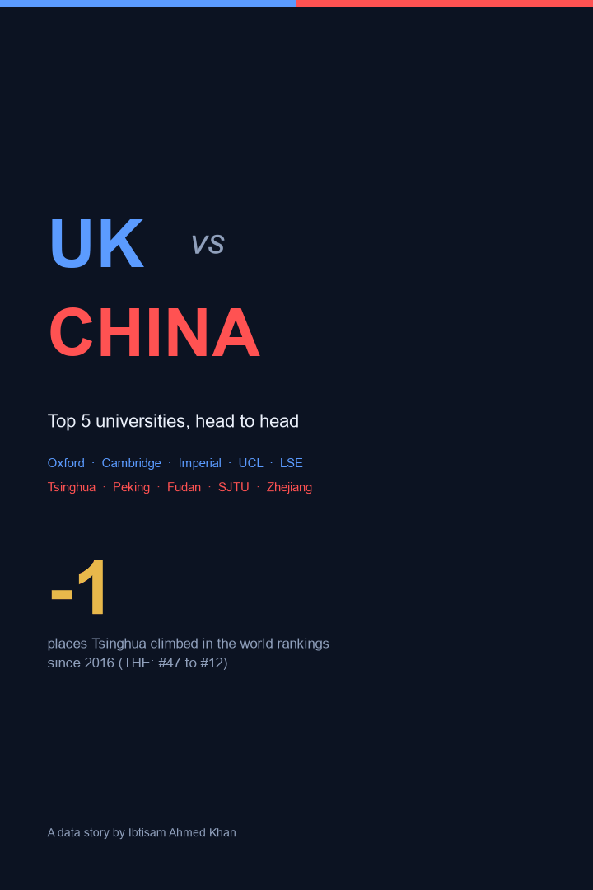

# UK vs China: Top 5 Universities, Head to Head

A comparison of the five leading universities in each country - Oxford, Cambridge, Imperial, UCL and LSE against Tsinghua, Peking, Fudan, Shanghai Jiao Tong and Zhejiang - told through the global rankings and the institutions themselves.

I studied my MSc at **Tsinghua University** in Beijing and now work with data in the **UK**, so these are the two university systems I know first-hand.

The format: **one vertical infographic poster that builds itself** - the rankings rise, a top-5 head-to-head, internationalisation, and student-body size, all animating on a single canvas. UK blue vs China crimson, with an academic-gold accent.

## The poster



An MP4 version is included for platforms that freeze GIFs (LinkedIn does).

## Key findings

| Finding | Numbers |
|---|---|
| Chinese universities are climbing fast | Tsinghua rose from THE #47 (2016) to #12 (2025) - up 35 places; Peking up 29 |
| UK elites still hold the summit | Oxford has been THE #1 every year since 2017; Cambridge and Imperial stay in the top 10 |
| Two different scales | Average top-5 student body: China ~49k vs UK ~26k. Zhejiang alone has 62k students; LSE just 13k |
| Internationalisation is the UK's edge | UK top-5 average 54% international students (LSE 70%) vs China's 12% |
| Old world vs new | UK elites average ~1587 as a founding year (Oxford 1096); the Chinese top five are all founded 1896-1911 |

## Honest limitations

- **Rankings are contested.** QS and THE use different methodologies and disagree by design; a single number flattens teaching, research, reputation and citations into one figure.
- Figures are point-in-time (QS 2026, THE 2025) and rounded; treat them as illustrative, not definitive.
- "Top 5" uses the best-ranked five per country, which is itself a ranking-dependent choice.

## What's in the analysis

1. Compiled QS 2026 / THE 2025 ranking data plus institutional figures (size, international share, founding year)
2. Inverted-axis rank-history chart showing the Chinese rise against UK stability
3. Centre-out head-to-head bars on top-5 country averages
4. A 33-frame self-building poster rendered entirely in matplotlib and exported with imageio

## Repository structure

```
build_poster.py      # one-poster animated infographic pipeline
data/                # rankings + institutional figures (CSV)
charts/              # static poster (PNG)
gifs/                # animated poster (GIF + MP4)
linkedin-post.txt    # ready-to-publish post copy
```

Run: `pip install pandas numpy matplotlib imageio imageio-ffmpeg`, then `python build_poster.py`.

**Data sources:** QS World University Rankings 2026; Times Higher Education World University Rankings (2016-2025); university public figures. For illustration, not advice.

*Author: Ibtisam Ahmed Khan - [linkedin.com/in/ibtisam-ahmed-khan](https://linkedin.com/in/ibtisam-ahmed-khan)*
